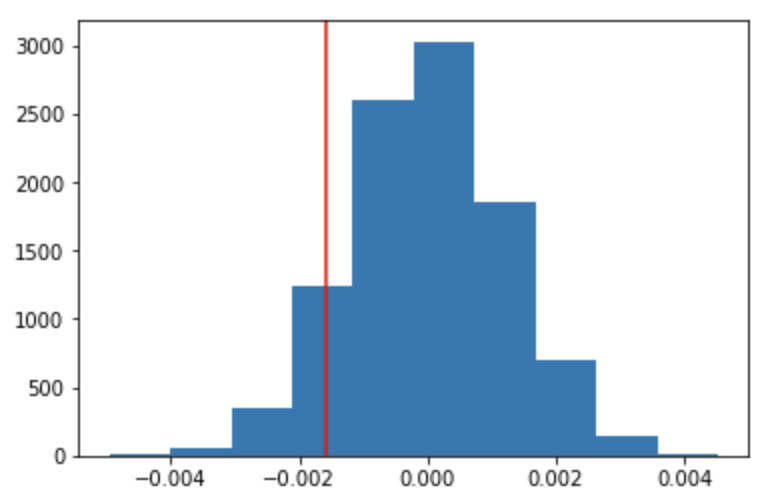
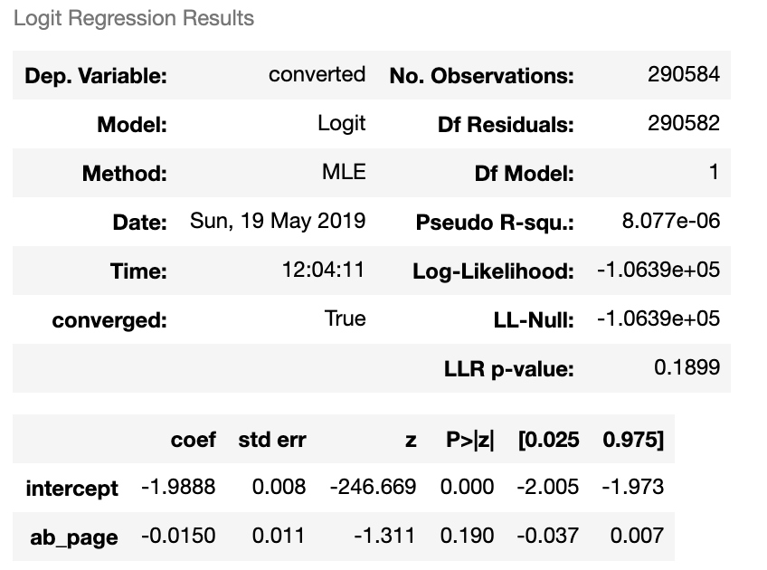
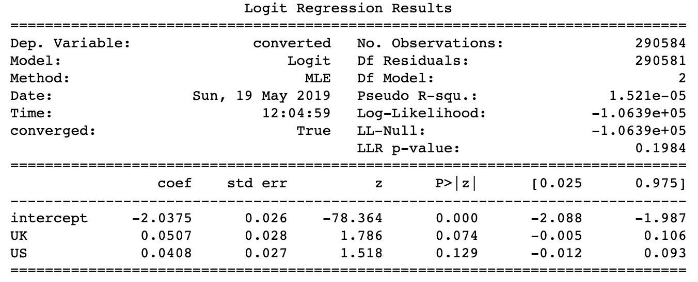
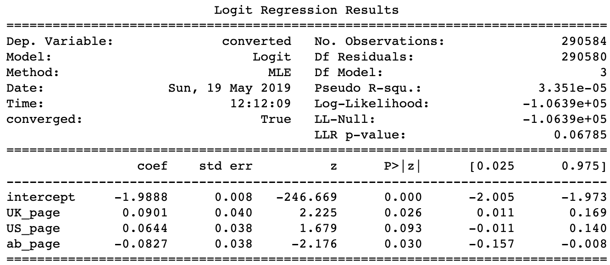

## Analyze A/B Test Results

## Table of Contents
- [Introduction](#intro)
- [Part I - Probability](#probability)
- [Part II - A/B Test](#ab_test)
- [Part III - Regression](#regression)


<a id='intro'></a>
### Introduction

A/B tests are very commonly performed by data analysts and data scientists.  It is important that you get some practice working with the difficulties of these 

For this project, you will be working to understand the results of an A/B test run by an e-commerce website.  Your goal is to work through this notebook to help the company understand if they should implement the new page, keep the old page, or perhaps run the experiment longer to make their decision.

<a id='probability'></a>
#### Part I - Probability

To get started, let's import our libraries.

```python
import pandas as pd
import numpy as np
import random
import matplotlib.pyplot as plt
%matplotlib inline
#We are setting the seed to assure you get the same answers on quizzes as we set up
random.seed(42)
```

`1.` Now, read in the `ab_data.csv` data. Store it in `df`.  **Use your dataframe to answer the questions in Quiz 1 of the classroom.**

a. Read in the dataset and take a look at the top few rows here:
```python
df = pd.read_csv('ab_data.csv')
```
b. Use the cell below to find the number of rows in the dataset.
```python
df.shape[0] #294478
```
c. The number of unique users in the dataset.
```python
df.user_id.nunique() #290584
```
d. The proportion of users converted.
```python
(df.converted == 1).mean() #0.11965919355605512
```
e. The number of times the `new_page` and `treatment` don't match.
```python
t = df.query('landing_page == "old_page" and group == "treatment"').user_id.size
c = df.query('landing_page == "new_page" and group == "control"').user_id.size
t + c #3893
```
f. Do any of the rows have missing values?
```python
df.isnull().values.any() #False
```

`2.` For the rows where **treatment** does not match with **new_page** or **control** does not match with **old_page**, we cannot be sure if this row truly received the new or old page.  Use **Quiz 2** in the classroom to figure out how we should handle these rows.  

a. Now use the answer to the quiz to create a new dataset that meets the specifications from the quiz.  Store your new dataframe in **df2**.
```python
df_1 = df.query('landing_page == "old_page" and group == "control"') 
df_2 = df.query('landing_page == "new_page" and group == "treatment"')
df2 = df_1.append(df_2, ignore_index=True)
```
```python
# Double Check all of the correct rows were removed - this should be 0
df2[((df2['group'] == 'treatment') == (df2['landing_page'] == 'new_page')) == False].shape[0] #0
```
`3.` Use **df2** and the cells below to answer questions for **Quiz3** in the classroom.
a. How many unique **user_id**s are in **df2**?
```python
df2.user_id.nunique() #290584
```
b. There is one **user_id** repeated in **df2**.  What is it?
```python
df2[df2.user_id.duplicated()]
```
c. What is the row information for the repeat **user_id**? 
```python
df2.iloc[146678]
```
d. Remove **one** of the rows with a duplicate **user_id**, but keep your dataframe as **df2**.
```python
df2.drop(146678,inplace=True)
```
`4.` Use **df2** in the cells below to answer the quiz questions related to **Quiz 4** in the classroom.

a. What is the probability of an individual converting regardless of the page they receive?
```python
(df2.converted == 1).mean() #0.11959708724499628
```
b. Given that an individual was in the `control` group, what is the probability they converted?
```python
obs_control = (df2.query('group == "control"')['converted'] == 1).mean()
obs_control #0.1203863045004612
```
c. Given that an individual was in the `treatment` group, what is the probability they converted?
```python
obs_treatment = (df2.query('group == "treatment"')['converted'] == 1).mean()
obs_treatment #0.11880806551510564
```
d. What is the probability that an individual received the new page?
```python
(df2.landing_page == "new_page").mean() #0.50006194422266881
```
```python
obs_treatment - obs_control #-0.0015782389853555567
``` 
e. Consider your results from parts (a) through (d) above, and explain below whether you think there is sufficient evidence to conclude that the new treatment page leads to more conversions.

The difference is very smaller and from the observed data difference, it does not seem like there is sufficient evidence to conclude that new treatment page leads to more conversions.

<a id='ab_test'></a>
### Part II - A/B Test

Notice that because of the time stamp associated with each event, you could technically run a hypothesis test continuously as each observation was observed.  

However, then the hard question is do you stop as soon as one page is considered significantly better than another or does it need to happen consistently for a certain amount of time?  How long do you run to render a decision that neither page is better than another?  

These questions are the difficult parts associated with A/B tests in general.  


`1.` For now, consider you need to make the decision just based on all the data provided.  If you want to assume that the old page is better unless the new page proves to be definitely better at a Type I error rate of 5%, what should your null and alternative hypotheses be?  You can state your hypothesis in terms of words or in terms of **$p_{old}$** and **$p_{new}$**, which are the converted rates for the old and new pages.

The null hypothesis H0 is that the old page will result in the same conversion rate as the new page.

The H1 is that the old page will not result in the same conversion rate as the new page and the new page will result in better conversion rate.

`2.` Assume under the null hypothesis, $p_{new}$ and $p_{old}$ both have "true" success rates equal to the **converted** success rate regardless of page - that is $p_{new}$ and $p_{old}$ are equal. Furthermore, assume they are equal to the **converted** rate in **ab_data.csv** regardless of the page. <br><br>

Use a sample size for each page equal to the ones in **ab_data.csv**.  <br><br>

Perform the sampling distribution for the difference in **converted** between the two pages over 10,000 iterations of calculating an estimate from the null.  <br><br>

Use the cells below to provide the necessary parts of this simulation.  If this doesn't make complete sense right now, don't worry - you are going to work through the problems below to complete this problem.  You can use **Quiz 5** in the classroom to make sure you are on the right track.<br><br>

a. What is the **conversion rate** for $p_{new}$ under the null? 
```python
p_new = df2.converted.mean()
p_new # 0.11959708724499628
```
b. What is the **conversion rate** for $p_{old}$ under the null? <br><br>
```python
p_old = df2.converted.mean()
p_old #0.11959708724499628
```
c. What is $n_{new}$, the number of individuals in the treatment group?
```python
treatment_size = df2[df2['group'] == "treatment"].shape[0]
treatment_size # 145310
```
d. What is $n_{old}$, the number of individuals in the control group?
```python
control_size = df2[df2['group'] == "control"].shape[0]
control_size # 145274
```
We will now generate the observed mean difference of the data set.
```python
obs_treatment_mean = df2[df2['group'] == "treatment"]['converted'].mean()
obs_control_mean = df2[df2['group'] == "control"]['converted'].mean()
obs_diff = obs_treatment_mean - obs_control_mean
obs_diff # -0.0015782389853555567
```
e. Simulate $n_{new}$ transactions with a conversion rate of $p_{new}$ under the null.  Store these $n_{new}$ 1's and 0's in **new_page_converted**.
```python
new_page_converted = np.random.choice([0,1],size=treatment_size,p=[1-p_new,p_new])
```
f. Simulate $n_{old}$ transactions with a conversion rate of $p_{old}$ under the null.  Store these $n_{old}$ 1's and 0's in **old_page_converted**.
```python
old_page_converted = np.random.choice([0,1],size=treatment_size,p=[1-p_old,p_old])
```
g. Find $p_{new}$ - $p_{old}$ for your simulated values from part (e) and (f).
```python
bs_diff = new_page_converted.mean() - old_page_converted.mean()
bs_diff # -6.8818388273272912e-06
```
h. Create 10,000 $p_{new}$ - $p_{old}$ values using the same simulation process you used in parts (a) through (g) above. Store all 10,000 values in a NumPy array called **p_diffs**.
```python
p_diffs = []
for _ in range(10000):
    new_page_converted_multi = np.random.choice([0,1],size=treatment_size,p=[1-p_new,p_new])
    old_page_converted_multi = np.random.choice([0,1],size=treatment_size,p=[1-p_old,p_old])
    p_diffs.append(new_page_converted_multi.mean() - old_page_converted_multi.mean())
```
```python
p_diffs = np.array(p_diffs)
```
i. Plot a histogram of the **p_diffs**.  Does this plot look like what you expected?  Use the matching problem in the classroom to assure you fully understand what was computed here.
```python
plt.hist(p_diffs);
plt.axvline(obs_diff,color='r');
```


```python
obs_diff # -0.0015782389853555567
```
j. What proportion of the **p_diffs** are greater than the actual difference observed in **ab_data.csv**?
```python
(p_diffs > obs_diff).mean() # 0.90580000000000005
```
k. Please explain using the vocabulary you've learned in this course what you just computed in part **j.**  What is this value called in scientific studies?  What does this value mean in terms of whether or not there is a difference between the new and old pages?

In part **h,** we have simulated 10000 times of the sample distribution while assuming the null hypothesis is true (which is that there is **no** difference between new page and old page). We simulated the sample distributions using the properties of the observed sample data set, including the size and probabilities. 
In part **j,**, we look for the p-value using the mean of differences of the observed data set against the simulated sample distribution which is normally distributed due to the central limit theorem. We found the p-value to be **0.905** which is greater than 0.05, the alpha value. 
As a result, we cannot reject H0, which means the difference in mean in the observed data set (obs_diff) is too insignificant.

l. We could also use a built-in to achieve similar results.  Though using the built-in might be easier to code, the above portions are a walkthrough of the ideas that are critical to correctly thinking about statistical significance. Fill in the below to calculate the number of conversions for each page, as well as the number of individuals who received each page. Let `n_old` and `n_new` refer the the number of rows associated with the old page and new pages, respectively.
```python
import statsmodels.api as sm

convert_old = df2[(df2['group'] == "control") & (df2['converted'] == 1)].shape[0] #17489
convert_new = df2[(df2['group'] == "treatment") & (df2['converted'] == 1)].shape[0] #17264
n_old = df2.query('group == "control"').shape[0] #145274
n_new = df2.query('group == "treatment"').shape[0] #145310
```
m. Now use `stats.proportions_ztest` to compute your test statistic and p-value.  [Here](http://knowledgetack.com/python/statsmodels/proportions_ztest/) is a helpful link on using the built in.
```python
zstat, pval = sm.stats.proportions_ztest([convert_new, convert_old], [n_new, n_old], alternative='larger')
zstat,pval # (-1.3109241984234394, 0.90505831275902449)
```
n. What do the z-score and p-value you computed in the previous question mean for the conversion rates of the old and new pages?  Do they agree with the findings in parts **j.** and **k.**?

The p-value is consistent with my finding in part j.
And the z-value is consistent with that shown on the histagram, in which the observed difference is around 1.31 to the left of the center of the graph

<a id='regression'></a>
### Part III - A regression approach

`1.` In this final part, you will see that the result you achieved in the A/B test in Part II above can also be achieved by performing regression.<br><br> 

a. Since each row is either a conversion or no conversion, what type of regression should you be performing in this case?

Logistic regression

b. The goal is to use **statsmodels** to fit the regression model you specified in part **a.** to see if there is a significant difference in conversion based on which page a customer receives. However, you first need to create in df2 a column for the intercept, and create a dummy variable column for which page each user received.  Add an **intercept** column, as well as an **ab_page** column, which is 1 when an individual receives the **treatment** and 0 if **control**.

```python
df2['intercept'] = 1
```
```python
page_dummies = pd.get_dummies(df2['landing_page'])
df2['ab_page'] = pd.get_dummies(df2['group'])['treatment']
df2 = df2.join(page_dummies)
```

c. Use **statsmodels** to instantiate your regression model on the two columns you created in part b., then fit the model using the two columns you created in part **b.** to predict whether or not an individual converts. 

```python
lm = sm.Logit(df2['converted'],df2[['intercept','ab_page']]).fit().summary()
```



e. What is the p-value associated with **ab_page**? Why does it differ from the value you found in **Part II**?<br><br>  **Hint**: What are the null and alternative hypotheses associated with your regression model, and how do they compare to the null and alternative hypotheses in the **Part II**?"

p-value is 0.190 which is above an $\alpha$ level of 0.05. It means that `ab_page` is significant enough that we should reject our null hypothesis H0.

f. Now, you are considering other things that might influence whether or not an individual converts.  Discuss why it is a good idea to consider other factors to add into your regression model.  Are there any disadvantages to adding additional terms into your regression model?

We will want to add addition factors to see gain more insights into what factors will affect the conversion rate. However, relationship among factors can become more complicated if these factors are not indepedent of each other.

g. Now along with testing if the conversion rate changes for different pages, also add an effect based on which country a user lives in. You will need to read in the **countries.csv** dataset and merge together your datasets on the appropriate rows.  [Here](https://pandas.pydata.org/pandas-docs/stable/generated/pandas.DataFrame.join.html) are the docs for joining tables. 

Does it appear that country had an impact on conversion?  Don't forget to create dummy variables for these country columns - **Hint: You will need two columns for the three dummy variables.** Provide the statistical output as well as a written response to answer this question.

```python
country = pd.read_csv('countries.csv')
df2 = df2.set_index('user_id').join(country.set_index('user_id'),how='inner')
```
```python
country_dummies = pd.get_dummies(df2['country'])
df2 = df2.join(country_dummies)
```
```python
lm_with_country = sm.Logit(df2['converted'],df2[['intercept','UK','US']]).fit()
print(lm_with_country.summary())
```



According to the summary, it appears that both counties have p-values above an $\alpha$ level of 0.05 and therefore there is no statistical evidence that on country's impact on the conversion rate.

h. Though you have now looked at the individual factors of country and page on conversion, we would now like to look at an interaction between page and country to see if there significant effects on conversion.  Create the necessary additional columns, and fit the new model.  

Provide the summary results, and your conclusions based on the results.
```python
df2['US_page'] = df2['US'] * df2['ab_page']
df2['UK_page'] = df2['UK'] * df2['ab_page']
```
```python
lm_with_country_and_page = sm.Logit(df2['converted'],df2[['intercept','UK_page','US_page','ab_page']]).fit()
print(lm_with_country_and_page.summary())
```



After adding the ab_page factor, it appears that the p-value is now less than the $\alpha$ level of 0.05, as a result, we will now reject the null hypothesis and that this is statistical significant in the conversion rate difference of the `ab_page`.
